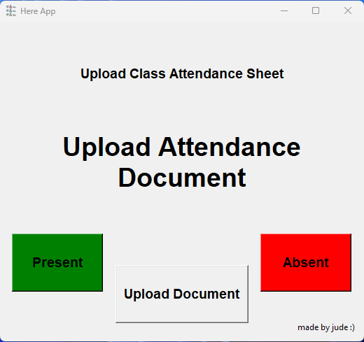

# Here App

Here App is a simple GUI application for marking attendance in a `.docx` document. It allows users to upload a class attendance sheet, display each student's name, and mark them as present or absent with the click of a button. The application is built using Python with `tkinter` for the GUI interface and `python-docx` for interacting with Word documents.
- I wrote it for a professor as I saw him struggle and spend alot of time during roll call. I made this with his permission so he can try it out and use
- The app/script name "Here" is what the professor will want us to reply to when a student is called. So I thought it will fit the script name.

  

## Features

- Upload `.docx` files containing attendance sheets.
- Navigate through student names in the document.
- Mark attendance as present or absent.
- Save the updated document automatically.

## Installation

Before running the application, ensure you have Python installed on your system. You can download Python from [here](https://www.python.org/downloads/). After installing Python, you need to install the required packages using pip by running this command:

`pip install -r requirements.txt`

## Usage

To start the application, run the main.p(go into the folder where it is located) file:

`python main.py`

Once the application starts, follow these steps:

- Click on the "Upload Document" button to upload the attendance sheet.
- The application will display the name of the first student in the list.
- Use the "Present" or "Absent" buttons to mark the attendance for the displayed student name.
- The application will automatically proceed to the next student.
- Once all students have been marked, the application will save the document and display a confirmation message.
